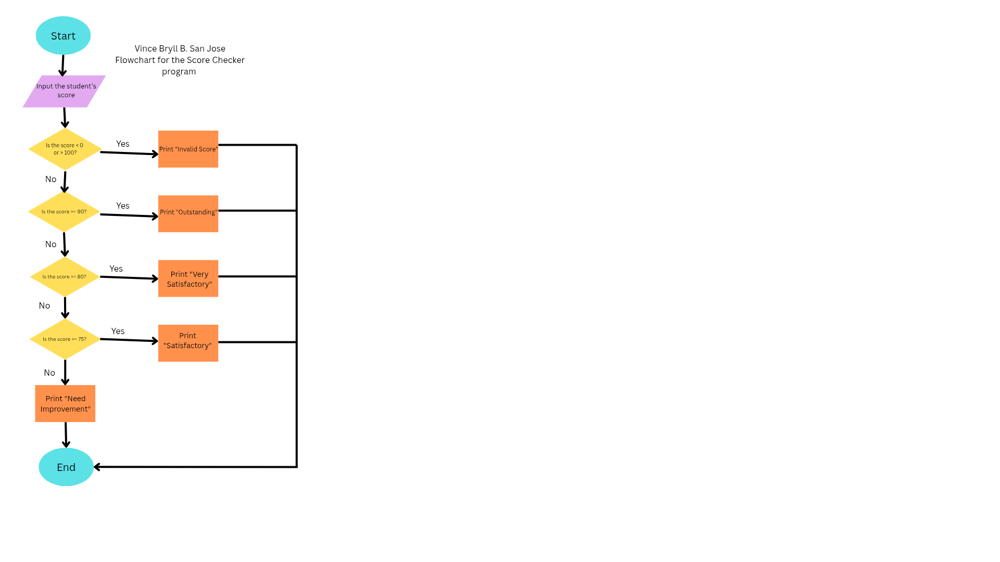

# Clean Decision Code Makeover: Student Score Checker 
**Name:** Vince Bryll B. San Jose
**Section:** Dahlia

# Activity Overview

In this activity, I improved a Student Score Checker program 
by applying proper coding standards and selection structures.

The program accepts a student score from 0 to 100 and
determines the appropriate classification 

The classifications are:

|Score | Classification |
|---: | --- |
| 90-100 | Outstanding |
| 80-89 | Very Satisfactory |
| 75-79 | Satisfactory |
| 0-74 | Needs Improvement |

Scores Below 0 or above 100 are considered invalid.

---

# Part 1 - Analyze the logic

## Input
What information does the program need?
>The program, score checker, needs the student’s score. 

## Valid Range
**Minimum valid score:**
>0

**Maximum valid score:**
>100

## Possible Outputs
List all possible outputs of the program 

1. Invalid Score
2. Needs Improvement
3. Satisfactory
4. Very satisfactory
5. Outstanding

## Boundary Condition 
What condition will you use to determine whether the score is valid?
>Boundary condition will be used when the student gives a score below 0 or above 100. Condition: 0  > score or score > 100

## Multiple Decision Paths
Explain how the program decides which classification should be displayed.
>The score must be validated first if it surpassed the boundaries, if not, it will be then classified based on how high their value is

# Part 2 - Flowchart 

## Flowchart 

# Part 3 - Pseudocode 

## Sample pseudocode 

START 

INPUT the student’s score

IF score < 0 OR score > 100 THEN
PRINT “Invalid Score”

ELSE IF score >= 90 THEN
PRINT “Outstanding”

ELSE IF score >= 80 THEN
PRINT “Very satisfactory” 

ELSE IF score >= 75 THEN
PRINT “Satisfactory”

ELSE 
PRINT “Needs Improvement”

END

# Part 4 - Clean Code Implementation 

## Source Code 

Click ->  

# Part 5 - Testing 
| Test | Input | Purpose | Expected Output | Actual Output | Result |
|---|---:|---|---|---|---|
| 1 | -1 | Below minimum | | | |
| 2 | 0 | Minimum boundary | | | |
| 3 | 74 | Below Satisfactory boundary | | | |
| 4 | 75 | Satisfactory boundary | | | |
| 5 | 80 | Very Satisfactory boundary | | | |
| 6 | 90 | Outstanding boundary | | | |
| 7 | 100 | Maximum boundary | | | |
| 8 | 101 | Above maximum | | | |

## Testing Reflection 
### 1. Why is it important to test the values 0 and 100?
>It is important to test 0 and 100 because they are the lowest and highest valid scores. Testing them helps make sure my program correctly accepts the boundary values.

### 2. Why did you also test -1 and 101?
>I tested -1 and 101 because they are just outside the valid range. This checks if the program correctly rejects scores that are too low or too high.

### 3. Which test helped you understand boundary conditions the most?
>Testing 0, 100, -1, and 101 helped me understand boundary conditions the most because they show how my program handles values at and just beyond the limits.

### 4. Did any of your tests initially fail? If yes, what did you change in your program?
>No. No error occured initially in my program.

# Reflection
### 1. How did selection structures make the program more useful?
>Selection structures made my program more useful because they allowed it to make decisions based on the score entered. For example,the program can determine whether the score is valid and identify the corresponding result or grade.

### 2. How did proper comments and readable formatting improve your program?
>Proper comments and readable formatting made my program easier to understand, check, and modify. They also helped explain what each part of the code does and made it easier to find errors.

### 3. Why is it useful to plan the program using a flowchart and pseudocode before writing the code?
>Planning with a flowchart and pseudocode helps organize the steps and logic of my program before writing the actual code. It makes the program easier to create and helps prevent mistakes.

